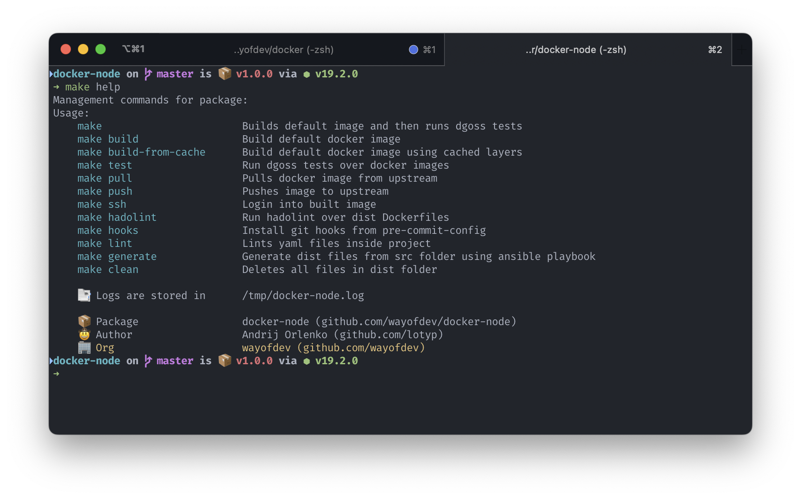

<br>

<div align="center">


</div>

<br>

<br>

<div align="center">
<a href="https://actions-badge.atrox.dev/wayofdev/docker-node/goto"></a>
<a href="https://github.com/wayofdev/docker-node/tags"></a>
<a href="https://hub.docker.com/repository/docker/wayofdev/node"></a>
<a href="LICENSE"></a>
<a href="#"></a>
</div>

<br>

# Docker Image: NodeJs Devel

This image is used in conjunction with [wayofdev/docker-php-dev](https://github.com/wayofdev/docker-php-dev) and other WOD images to create a local development environment for our projects.

## Pre-installed Packages

- [pnpm](https://pnpm.io/) - Fast, disk space efficient package manager
- [turbo](https://github.com/vercel/turbo) - Incremental bundler and build system optimized for JavaScript and TypeScript, written in Rust. Includes Turbopack and Turborepo.
- Alpine packages:
  - git
  - curl
  - libc6-compat - [turbo dependency](https://github.com/vercel/turbo/issues/2198), starting from `^1.5.6`

If you find this repository useful, please consider giving it a star. Thank you!



## ⚙️ Development

To install dependencies and start development, please check the contents of our `Makefile`.

### →  Requirements

To install dependencies and start development, please check the contents of our `Makefile`. You will need to have the following tools installed on your machine:

- **jq** - A lightweight and flexible command-line JSON processor. Please refer to the [official installation instructions](https://stedolan.github.io/jq/download/) to install `jq`.
- **goss** and **dgoss** - For testing purposes. Please follow the installation instructions provided in their [official README](https://github.com/aelsabbahy/goss/blob/master/extras/dgoss/README.md).

<br>

### → Building locally

To generate distributable Dockerfiles from the YAML source code, run the following command:

```bash
$ make generate
```

<br>

To build the default image, run the following commands:

```bash
$ git clone git@github.com:wayofdev/docker-node.git && cd docker-node
$ make generate #(optional, to re-create /dist from /src)
$ make build
```

To **build** the image, **test** it, and then **clean** temporary files, run the following command:

```bash
$ make
```

To build all images, run the following commands:

```bash
$ make build TEMPLATE="lts-alpine"
$ make build TEMPLATE="19-alpine"
$ make build TEMPLATE="18-alpine"
```

<br>

## 🧪 Testing

To test the default image, run the following command:

```bash
$ make test
```

To test all images, run the following commands:

```bash
$ make test TEMPLATE="lts-alpine"
$ make test TEMPLATE="19-alpine"
$ make test TEMPLATE="18-alpine"
```

<br>

### → Code quality tools

To validate all YAML files in the project, run the following command:

```bash
$ make lint
```

To validate the created Dockerfiles, run the following command:

```bash
$ make hadolint
```

<br>

## 🤝 License

[](./LICENSE)

<br>

## 🙆🏼‍♂️ Author Information

This repository was created in **2022** by [lotyp / wayofdev](https://github.com/wayofdev).

<br>

## 🫡 Contributors


<a href="https://github.com/wayofdev/docker-node/graphs/contributors">
  
</a>

<br>

